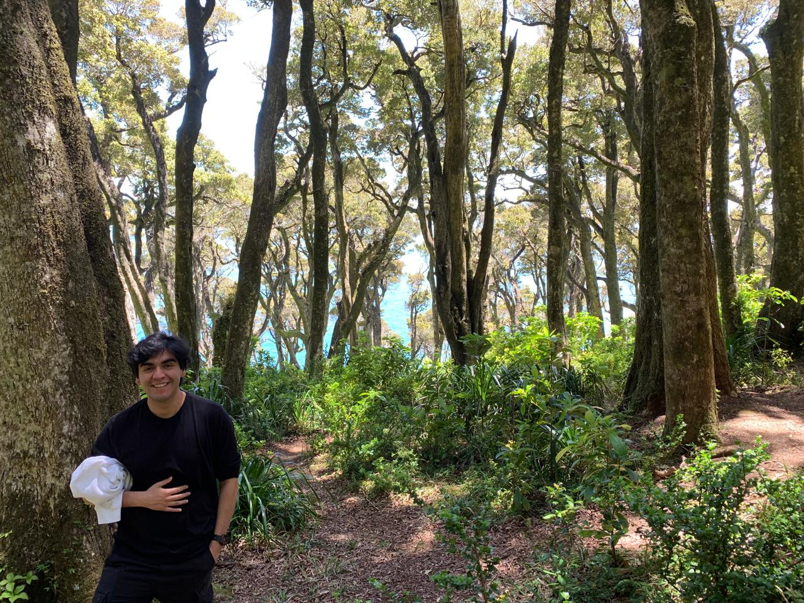

## About me

<!--  -->

My name is Felipe Labra Irribarra and I'm currently pursuing a Master's degree at Pontificia Universidad Católica de Chile under the supervision of [Eduardo Cerpa](https://www.mat.uc.cl/~eduardo.cerpa/). In the past I've got a Mathematical Engineering professional title at Universidad Técnica Federico Santa María under the supervision of [Patricio Guzmán](http://pguzman.mat.utfsm.cl/) and [Hugo Parada](https://sites.google.com/view/hugo-parada).

## Research interests

During my undergraduate studies I worked on Stabilization of Partial Differential Equations. On mostly of my masters studies I've been studying microlocal analysis and it's applications to stabilization and inverse problems. On my master's thesis I'm studying the stabilization of coupled Partial Differential Equations under small perturbations.

keloke
